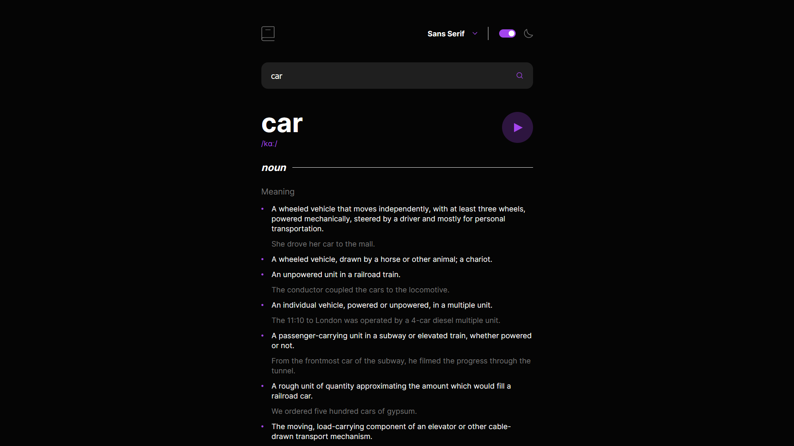

# Dictionary App

This website is a dictionary app.

## Project Functionality

Using this app users can enter a word in the input field and receive a definition for it. Response which users get can have an audio file with correct pronunciation of the word that users can play if they want. If there is no such word in the dictionary users will receive a correspondent message. The website has an optimal layout for the interface depending on the screen size of the user's device. It also has 2 different color themes that can be freely switched by the users. The default theme of the website depends on user's computer preferences.

You can visit website by clicking [this link](https://works.pikulinweb.ru/dictionary-app)

## Technologies used

- HTML
- SCSS
- Flexbox
- Adaptive layout
- TypeScript
- React
- React Hook Form
- Vite
- Dictionary API

## How to start

1. Clone the repository `git clone https://github.com/kanae367/dictionary-app`
2. Install all dependencies `npm install`
3. Run `npm run dev` command
